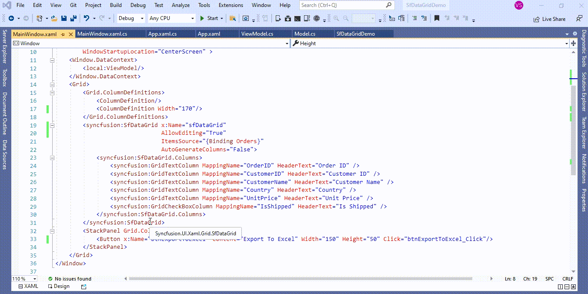
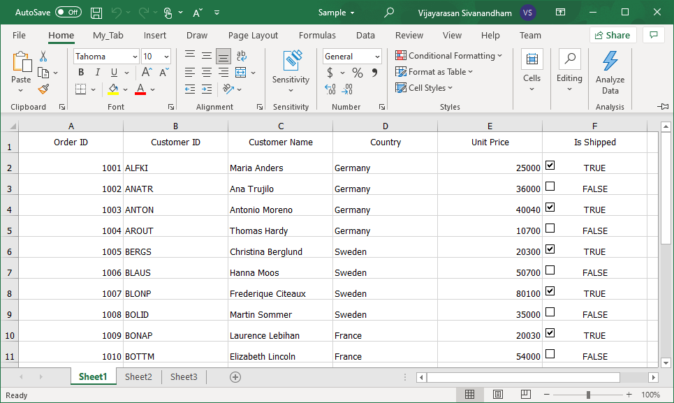

# How to Export the excel file with checkbox in WPF DataGrid (SfDataGid)?

## About the sample
This example illustrates how to Export the excel file with checkbox in [WPF DataGrid](https://www.syncfusion.com/wpf-controls/datagrid) (SfDataGid)? 

[WPF DataGrid](https://www.syncfusion.com/wpf-controls/datagrid) (SfDataGrid) does not provide the direct support to export the excel file with a checkbox. You can export the excel file with a checkbox by customization the [CellsExportingEventHandler](https://help.syncfusion.com/cr/wpf/Syncfusion.UI.Xaml.Grid.Converter.ExcelExportingOptions.html#Syncfusion_UI_Xaml_Grid_Converter_ExcelExportingOptions_CellsExportingEventHandler) of the [ExcelExportingOptions](https://help.syncfusion.com/cr/wpf/Syncfusion.UI.Xaml.Grid.Converter.ExcelExportingOptions.html) in [WPF DataGrid](https://www.syncfusion.com/wpf-controls/datagrid)(SfDataGrid).

```C#

private static void CellExportingHandler(object sender, GridCellExcelExportingEventArgs e)
{
    // Based on the column mapping name and the cell type, we can change the cell values while exporting to excel.
    if (e.CellType == ExportCellType.RecordCell && e.ColumnName == "IsShipped")
    {
        //add the checkbox into excel shhet
        var checkbox = e.Range.Worksheet.CheckBoxes.AddCheckBox(e.Range.Row, e.Range.Column, 20, 20);

        //set the checked or unchecked state based on cell value
        if (e.CellValue.ToString().ToLower() == "true")
            checkbox.CheckState = ExcelCheckState.Checked;
        else if (e.CellValue.ToString().ToLower() == "false")
            checkbox.CheckState = ExcelCheckState.Unchecked;

        //Created check box with cell link
        checkbox.LinkedCell = e.Range.Worksheet[e.Range.AddressLocal];

        e.Handled = true;
    }
}

private void btnExportToExcel_Click(object sender, RoutedEventArgs e)
{
    var options = new ExcelExportingOptions();
    options.ExcelVersion = ExcelVersion.Excel2013;
    options.CellsExportingEventHandler = CellExportingHandler;
    var excelEngine = sfDataGrid.ExportToExcel(sfDataGrid.View, options);
    var workBook = excelEngine.Excel.Workbooks[0];

    SaveFileDialog sfd = new SaveFileDialog
    {
         FilterIndex = 2,
         Filter = "Excel 97 to 2003 Files(*.xls)|*.xls|Excel 2007 to 2010 Files(*.xlsx)|*.xlsx|Excel 2013 File(*.xlsx)|*.xlsx"
    };

    if (sfd.ShowDialog() == true)
    {
         using (Stream stream = sfd.OpenFile())
         {
              if (sfd.FilterIndex == 1)
                  workBook.Version = ExcelVersion.Excel97to2003;
              else if (sfd.FilterIndex == 2)
                  workBook.Version = ExcelVersion.Excel2010;
              else
                  workBook.Version = ExcelVersion.Excel2013;
              workBook.SaveAs(stream);
         }

         //Message box confirmation to view the created workbook.
         if (MessageBox.Show("Do you want to view the workbook?", "Workbook has been created",
                             MessageBoxButton.YesNo, MessageBoxImage.Information) == MessageBoxResult.Yes)
         {
               //Launching the Excel file using the default Application.[MS Excel Or Free ExcelViewer]
               System.Diagnostics.Process.Start(sfd.FileName);
         }
    }
}

```



The following screenshot shows the exported excel file with a checkbox,



Take a moment to peruse the [WPF DataGrid – Export to Excel](https://help.syncfusion.com/wpf/datagrid/export-to-excel) documentation, where you can find about export to excel with code examples.

KB article - [How to Export the excel file with checkbox in WPF DataGrid (SfDataGid)?](https://www.syncfusion.com/kb/12761/how-to-export-the-excel-file-with-checkbox-in-wpf-datagrid-sfdatagid)

## Requirements to run the demo
Visual Studio 2015 and above versions
